# GBC-CR2025-FlexHolder

[](LICENSE)
[](https://www.kicad.org/)
[]()

**Removable CR2025 battery holder on flexible PCB for Game Boy Color cartridges.**

> Full article (FR) : [JLCPCB Blog || Support CR2025 amovible, PCB flexible, Game Boy Color](https://jlcpcb.com/fr/blog/support-cr2025-amovible-pcb-flexible-game-boy-color)

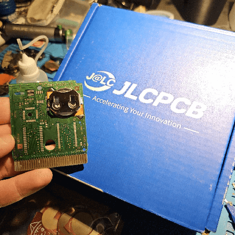

---

## The Problem

Game Boy Color cartridges use a CR2025 button cell to save game data. The problem: this battery is not a standard coin cell. It comes with **metal tabs welded directly onto it**, designed to be soldered onto the cartridge PCB.

When the battery dies, you have to desolder it. This is a delicate operation:
- The battery is pressed flat against the PCB, hard to access
- Too much heat risks damaging the PCB or the save chip
- Tabbed batteries are more expensive, harder to find, and often poor quality

**The idea:** replace this system with a removable holder, so any standard CR2025 can be swapped without soldering.

---

## The Solution

A **flexible PCB** soldered once in place of the original battery. It holds a metal clip (MY-2032-12) that keeps the battery in contact. To replace the battery, just clip it in — no soldering iron needed.

### Features
- Standard CR2025 coin cell, available anywhere, cheap
- Only 2 solder joints during installation (+ and −) || zero soldering after that
- Flexible PCB adapts to the tight space inside the cartridge
- Polyimide stiffener under the clip for mechanical rigidity
- Open source: KiCad source files and Gerbers included

---

## Schematic

Minimal schematic: one battery between VCC and GND. No active component, no resistor, no capacitor. The PCB is just an electrical bridge between the cartridge and the battery.

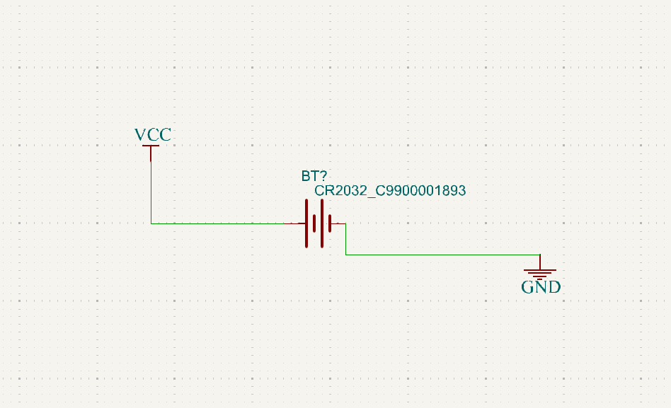

---

## PCB || Layout and 3D Render

The layout matches exactly the footprint of the original battery.

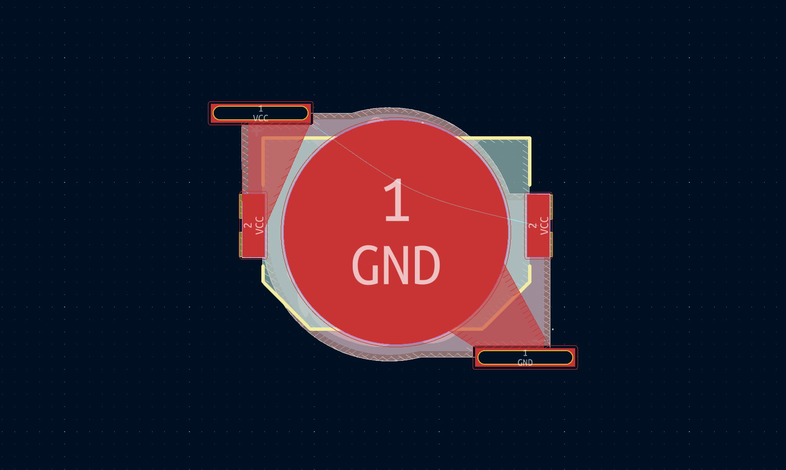

3D render || top (MY-2032-12 clip side):

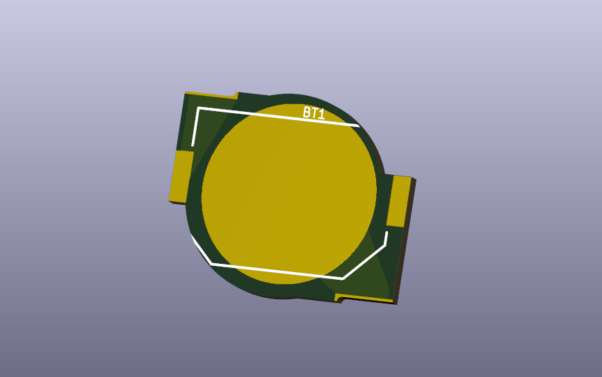

3D render || bottom (cat logo — because why not):


---

## Component || MY-2032-12 Clip

The clip used is the **MY-2032-12** by MYOUNG, JLCPCB part number **C964833**. Designed for CR2032, it works perfectly with the slightly thinner CR2025 thanks to the spring contact pressure.

| Parameter | Value |
|-----------|-------|
| Manufacturer | MYOUNG |
| Reference | MY-2032-12 |
| JLCPCB Part # | C964833 |
| Package | SMD |
| Material | Nickel phosphor bronze |
| Temperature | −25°C to +85°C |
| Mount | SMD |

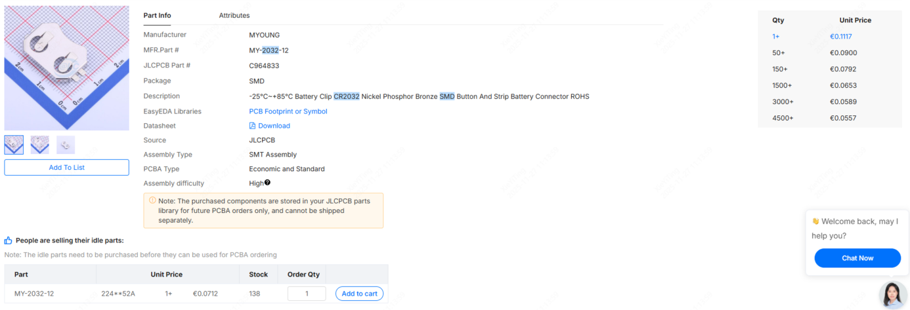

---

## Manufacturing at JLCPCB

### Order Settings

**File to upload:** `GERBERS-GBC-CR2025-FlexHolder.zip`

This is a **Flex PCB**, not a standard FR4 board.

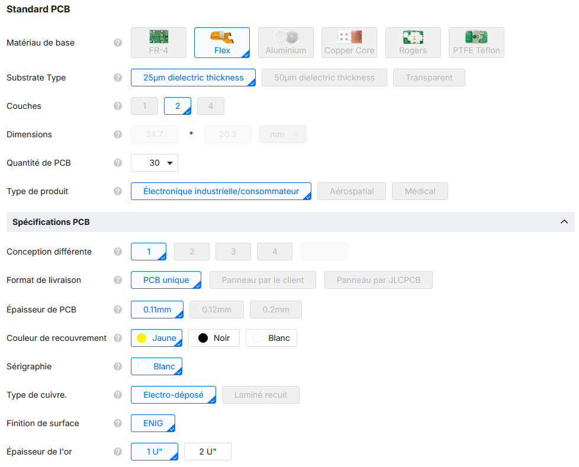

| Parameter | Value |
|-----------|-------|
| Type | Flex PCB |
| Substrate | 25 µm dielectric thickness |
| Layers | 2 |
| Dimensions | 24.7 × 20.3 mm |
| Thickness | 0.11 mm |
| Coverlay | Yellow |
| Silkscreen | White |
| Surface finish | ENIG |
| Gold thickness | 1 U" |
| Copper | Electro-deposited |
| Copper weight | 1/3 oz |

### Advanced Options || Polyimide Stiffener

The stiffener is mandatory: without it, the MY-2032-12 clip has no mechanical rigidity to hold the battery reliably.

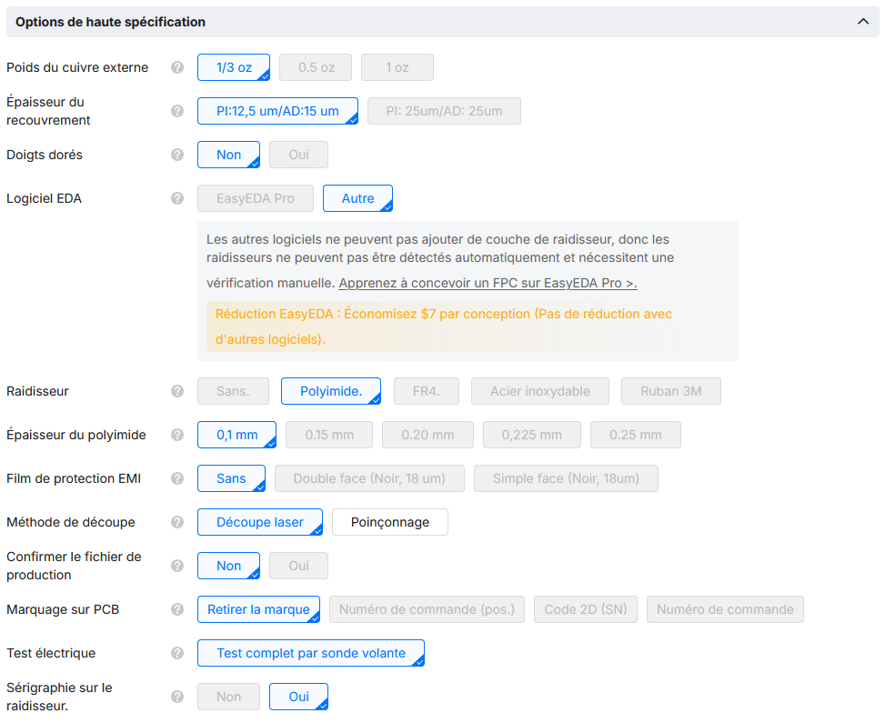

| Parameter | Value |
|-----------|-------|
| EDA software | Other (not EasyEDA Pro) |
| Stiffener | Polyimide |
| Polyimide thickness | 0.1 mm |
| Cutting method | Laser |
| Electrical test | Full flying probe test |
| Silkscreen on stiffener | Yes |

> **Important:** By selecting "Other" as EDA software, JLCPCB cannot auto-detect the stiffener layer. You must specify it manually in the **PCB Remark** field.

### Required PCB Remark

In the **PCB Remark** field of the order, write exactly:

```
Can you use the layer (User.9) for the polyimide stiffener.
```

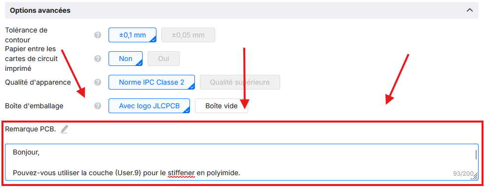

### User.9 Layer in KiCad

The stiffener area is defined on the `User.9` layer in KiCad. This is the layer that tells JLCPCB where to apply the rigid polyimide.

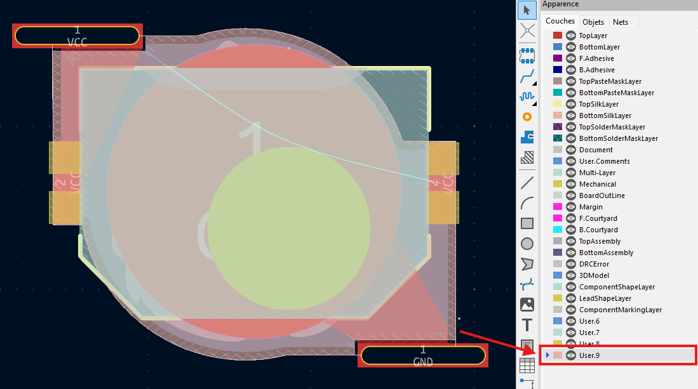

---

## Assembly

### What You Need

- 1 Game Boy Color cartridge (with dead tabbed CR2025)
- 1 flex PCB (this project, manufactured at JLCPCB)
- 1 MY-2032-12 clip (JLCPCB C964833)
- 1 standard CR2025 coin cell (no tabs)
- Soldering iron + solder

### Steps

**1. Open the cartridge** with a 3.8 mm Game Bit screwdriver.

**2. Desolder the original battery.** The tabbed battery is soldered on 2 pads (+ and −). Remove cleanly with a desoldering pump or braid.

**3. Clean the pads.**

**4. Position the flex PCB** at the original battery location. The 2 pads on the flex align with the 2 pads on the cartridge.

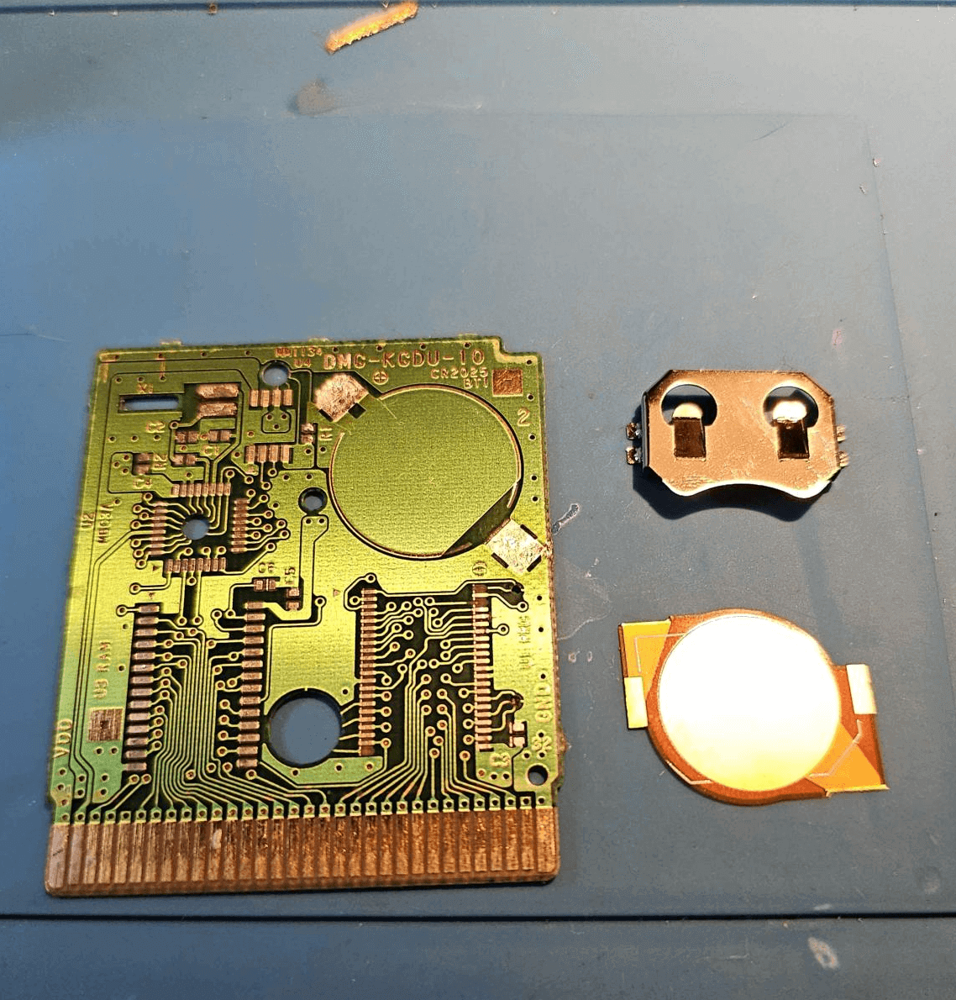

**5. Solder the 2 contact points** (positive + negative). This is the only soldering for the entire lifetime of the mod.

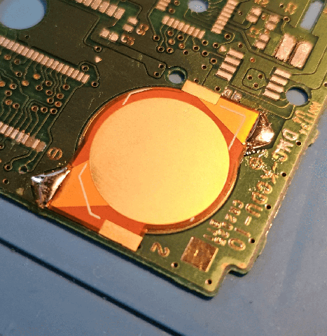

**6. Clip a standard CR2025** into the MY-2032-12 clip.

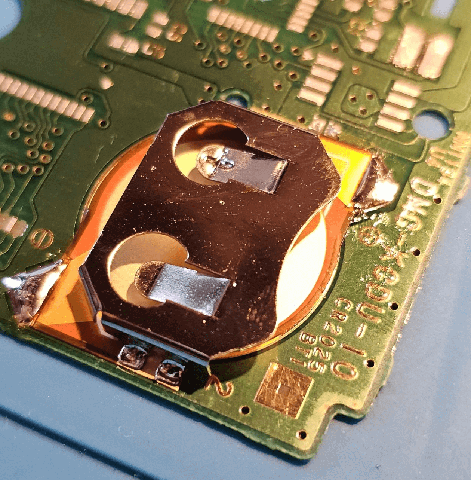

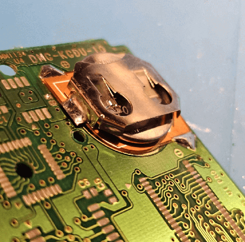

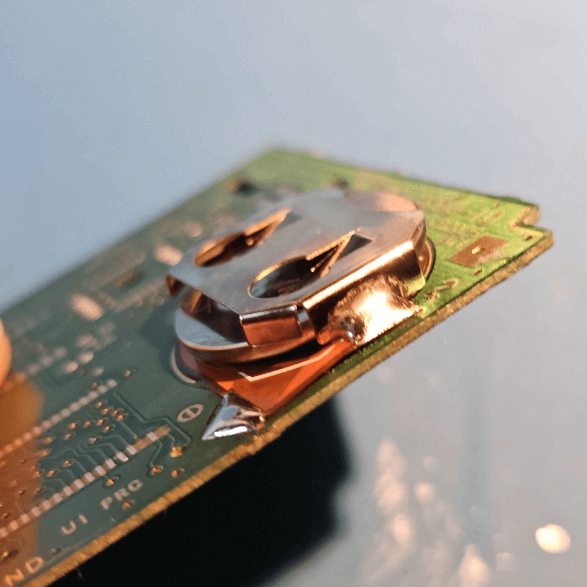

**7. Close the cartridge.**

For future replacements: open the cartridge, pop out the old CR2025, clip in a new one. No soldering.

---

## Files

```
/
├── README.md
├── LICENSE                                       ← CERN-OHL-S v2
├── CONTRIBUTING.md
├── supports de pile cr2025 GBC.kicad_pro         ← KiCad project
├── supports de pile cr2025 GBC.kicad_pcb         ← PCB layout
├── supports de pile cr2025 GBC.kicad_sch         ← Schematic
├── supports de pile cr2025 GBC.pretty/           ← Footprint library
├── GERBERS-GBC-CR2025-FlexHolder/                ← Gerber files
│   ├── *.gbr                                     ← Gerber layers
│   ├── *.drl                                     ← Drill files
│   └── *-job.gbrjob                              ← Gerber job file
└── GERBERS-GBC-CR2025-FlexHolder.zip             ← Archive to upload to JLCPCB
```

---

## Contributing

See [CONTRIBUTING.md](CONTRIBUTING.md).

---

## License

Design files licensed under [CERN Open Hardware Licence Version 2 - Strongly Reciprocal (CERN-OHL-S v2)](LICENSE).

Free to use, study, modify and distribute. Any modified version distributed must be under the same license.

---

## Français

**Support de pile CR2025 amovible sur PCB flexible pour cartouches Game Boy Color.**

Les cartouches Game Boy Color utilisent une pile CR2025 à languettes soudées. Quand elle est morte, il faut la dessouder || opération risquée pour le PCB. Ce mod remplace la pile d'origine par un PCB flexible avec un clip MY-2032-12 : on soude une fois (+ et −), et on clipse les piles CR2025 standard sans jamais ressouder.

**Fabrication :** Flex PCB chez JLCPCB, raidisseur polyimide sur couche `User.9`. Indiquer dans la remarque PCB : `Pouvez-vous utiliser la couche (User.9) pour le stiffener en polyimide.`

Article complet : [JLCPCB Blog](https://jlcpcb.com/fr/blog/support-cr2025-amovible-pcb-flexible-game-boy-color)
